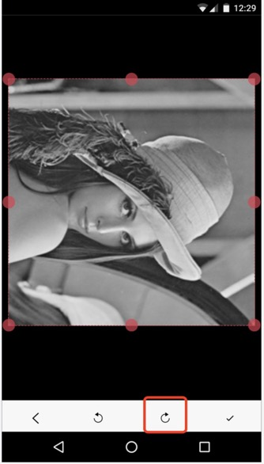
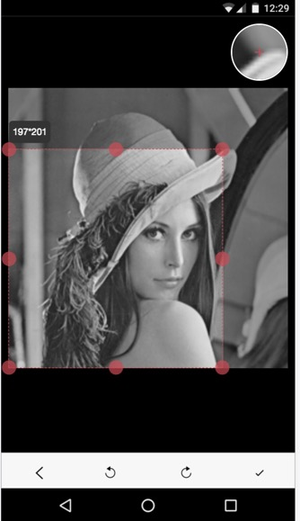

# Image-Clip

图像的裁剪压缩

功能包括：

- `canvas`绘制图片

- 裁剪框选择裁剪大小

- 旋转功能

- 放大镜（方便旋转）

- 裁剪功能

- 缩放、压缩功能（通过参数控制）

## 示例

[https://dailc.github.io/image-process/examples/clip.html](https://dailc.github.io/image-process/examples/clip.html)


## 效果






## 使用

引入

```js
dist/image-clip.css
dist/image-clip.js
```

全局变量

```js
ImageClip
```

调用方法

```js
var cropImage = new ImageClip(options);

cropImage.method()
```

`img`对象示例

```js
var img = new Image();

img.src = b64;

img.onload = function() {
    // 需要在onload中进行操作
    new ImageClip(...);
};
```

## options配置

| 参数 | 参数类型 | 默认值 |说明 |
| :------------- |:-------------:|:-------------:|:-------------|
| container | String | '#imgclip' | 容器的selector |
| img | Image | null | 需要裁剪的图像对象，必须存在 |
| isSmooth | Boolean | true | 是否开启平滑模式 |
| captureRadius | Number | 30 | 放大镜捕获的图像像素半径 |
| quality | Number | 0.92 | 图像压缩质量，注意，为`1`的时候可能比原图还大 |
| mime | String | 'image/jpeg' | 生成图像时的`MIME`类型 |
| sizeTipsStyle | Number | 0 | 大小提示框的风格，`0`表示按下时显示，`1`表示恒显示，`-1`表示永不显示 |
| compressScaleRatio | Number | 1 | 裁剪压缩时的缩放系数，最终尺寸为：`屏幕像素*像素比（手机一般为2）*compressScaleRatio` |
| iphoneFixedRatio | Number | 2 | 在`iphone`情况下再放大一个系数，以解决可能的模糊问题，最终尺寸为：`已计算的最终尺寸*iphoneFixedRatio` |
| isUseOriginSize | Boolean | false | 是否采用原图像素，__优先级高于上述所有__，如果为`true`，最终尺寸为：`原图大小` |
| maxWidth | Number | 0 | 最大宽度，__优先级高于上述所有__，大于这个宽度的图片会强行缩放成这个宽，小于的按照上面的规则进行缩放，为`0`时表示不设置 |
| forceWidth | Number | 0 | 强制设置宽度，__优先级高于上述所有__，最终宽度为：`forceWidth`，为`0`时表示不设置 |
| forceHeight | Number | 0 | 同上，但是一般不建议设置，因为很可能会改变宽高比导致拉升，特殊场景下使用 |

注意⚠️：

- 默认情况下裁剪时，最终尺寸不会超过原有图像的尺寸

- `最终尺寸`指的是裁剪框最大时的尺寸

- 除非设置`forceHeight`，否则图像的宽高比是不会变的

## API

### resetClipRect

重置裁剪框，重新变为最大

```js
cropImage.resetClipRect();
```

### clip

裁剪图像，根据当前的裁剪框进行裁剪

```js
cropImage.clip();
```

### getClipImgData

获取已裁剪的图像

```js
var base64 = cropImage.getClipImgData();
```

__返回说明__

| 参数 | 参数类型 | 说明 |
| :------------- |:-------------:|:-------------|
| base64 | String | 裁剪后的图像的`base64`数据 |

### rotate

旋转图片

```js
cropImage.clip(isClockWise);
```

__参数说明__

| 参数 | 参数类型 | 说明 |
| :------------- |:-------------:|:-------------|
| isClockWise | Boolean | 是否是顺时针旋转 |

### destroy

销毁当前的裁剪对象

如果一个容器需要重新生成裁剪对象，一定要先销毁以前的

```js
cropImage.destroy();
```